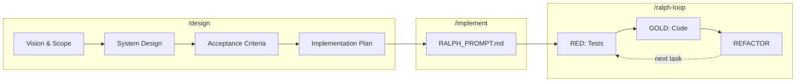
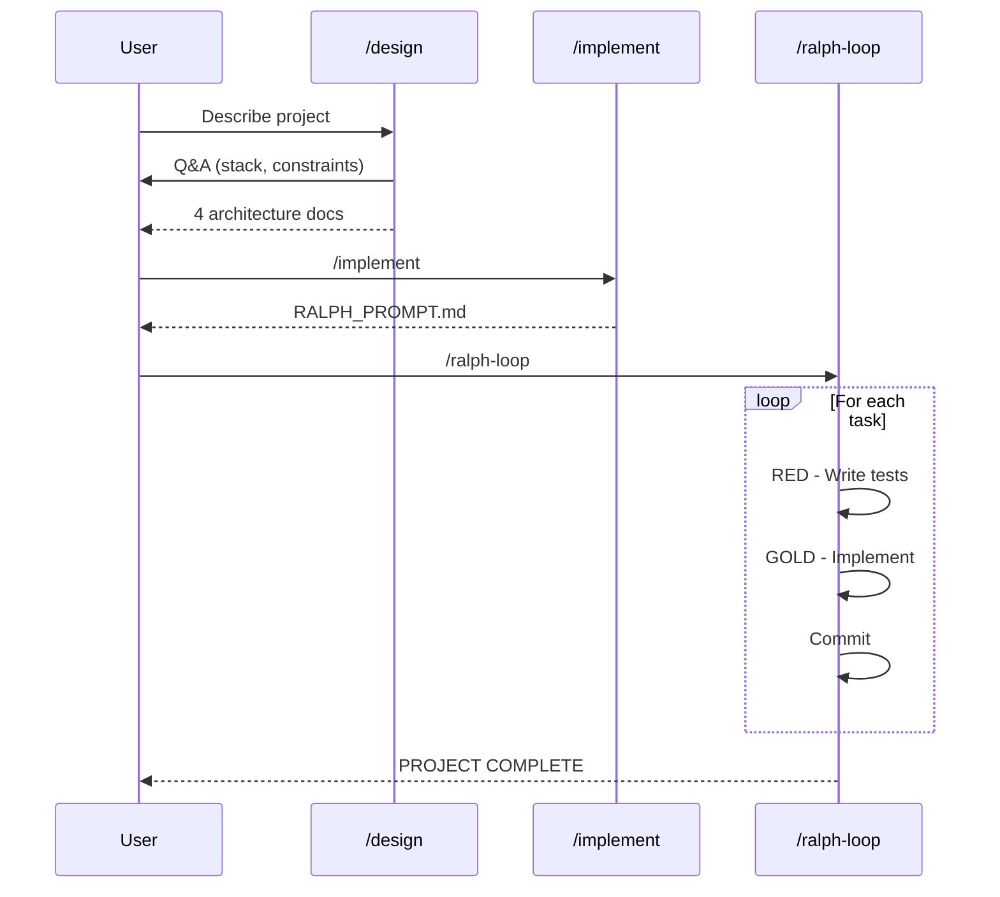
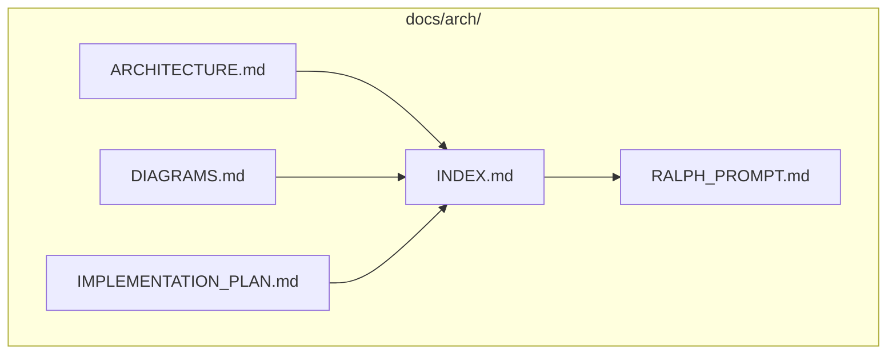
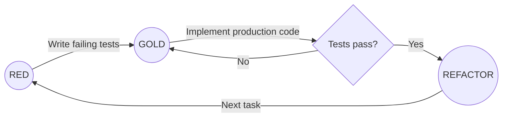

# v-to-ralph

V-Model implementation pipeline for Claude Code. Design architecture with testable acceptance criteria, then execute autonomous implementation via Ralph Loop.

## Overview

This plugin implements the [V-Model](https://en.wikipedia.org/wiki/V-model_(software_development)) of software development:



- **Left branch** (`/design`): Design with BDD acceptance criteria
- **Bridge** (`/implement`): Generate execution prompt
- **Right branch** (`/ralph-loop`): GS-TDD implementation with [Ralph Wiggum loop](https://github.com/anthropics/claude-code/tree/main/plugins/ralph-wiggum)

## Why V-Model?

The left branch of the V-Model is essentially **waterfall** — detailed upfront design before implementation. For human developers, this is often impractical: requirements change, designs become outdated, and the rigidity slows iteration.

**But for AI agents, it's ideal:**

| Aspect | Human Problem | AI Agent Advantage |
|--------|---------------|-------------------|
| Upfront design | Feels like overhead | Provides clear execution context |
| Detailed specs | Become stale quickly | Agent executes immediately, no staleness |
| Rigid structure | Limits adaptability | Reduces ambiguity, fewer hallucinations |
| Acceptance criteria | Extra documentation burden | Machine-checkable success criteria |

**The key insight**: What makes waterfall painful for humans (extensive planning before coding) is exactly what makes AI agents effective (unambiguous instructions with verifiable outcomes).

The right branch then leverages another AI strength: **tireless, systematic execution**. An agent can run hundreds of test iterations without fatigue, methodically working through each criterion until all tests pass.

## How It Works



## Output Files



| File | Content |
|------|---------|
| `ARCHITECTURE.md` | Vision, boundaries, ubiquitous language, system design, acceptance criteria |
| `DIAGRAMS.md` | Sequence diagrams (happy path + complex scenarios) |
| `IMPLEMENTATION_PLAN.md` | Persistent memory — phased tasks, progress tracking |
| `INDEX.md` | Navigation, tasks-to-criteria mapping |
| `RALPH_PROMPT.md` | Stack-specific GS-TDD execution instructions |

## Quick Start

```bash
# 1. Design architecture
/design "Build a CLI tool for managing Docker containers"

# 2. Generate loop setup
/implement

# 3. Execute implementation
/ralph-loop
```

## GS-TDD

Gold-Standard Test-Driven Development replaces classic Red-Green-Refactor:



| Phase | Classic TDD | GS-TDD |
|-------|-------------|--------|
| RED | Minimal failing test | Comprehensive tests covering ALL criteria |
| GREEN/GOLD | Make it pass (any code) | Production-ready code from start |
| REFACTOR | Clean up | Only if needed, tests stay green |

**Why GS-TDD for AI agents?**
- Tests serve as persistent memory across iterations
- Comprehensive coverage prevents regression
- No throwaway code that needs rewriting

## Supported Stacks

| Language | Test Framework | Containers |
|----------|---------------|------------|
| Go | `testing` | testcontainers-go |
| Rust | `cargo test` | testcontainers-rs |
| Python | pytest | testcontainers |
| Node.js/TypeScript | Vitest | testcontainers |
| .NET/C# | xUnit | Testcontainers |

## Installation

TODO describe

## Project Structure

```
v-to-ralph/
├── package/
│   ├── plugin.json                   # Plugin manifest
│   └── skills/
│       ├── design/
│       │   ├── SKILL.md              # /design implementation
│       │   └── templates/            # Output file templates
│       │       ├── ARCHITECTURE.md.template
│       │       ├── DIAGRAMS.md.template
│       │       ├── IMPLEMENTATION_PLAN.md.template
│       │       └── INDEX.md.template
│       └── implement/
│           └── SKILL.md              # /implement implementation
├── README.md
└── CLAUDE.md
```

## Requirements

- [ralph-wiggum](https://github.com/anthropics/claude-code/tree/main/plugins/ralph-wiggum) plugin (for `/ralph-loop`)
- Docker (for Testcontainers)

## License

MIT
