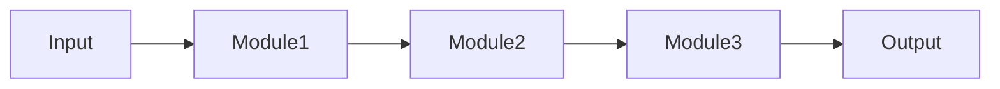
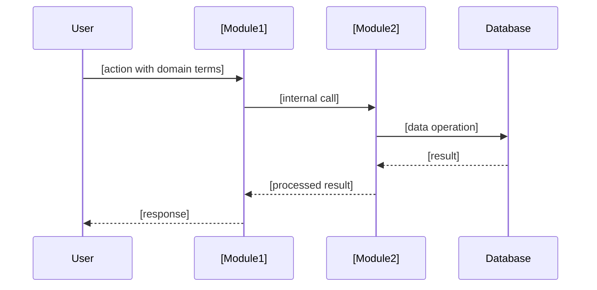
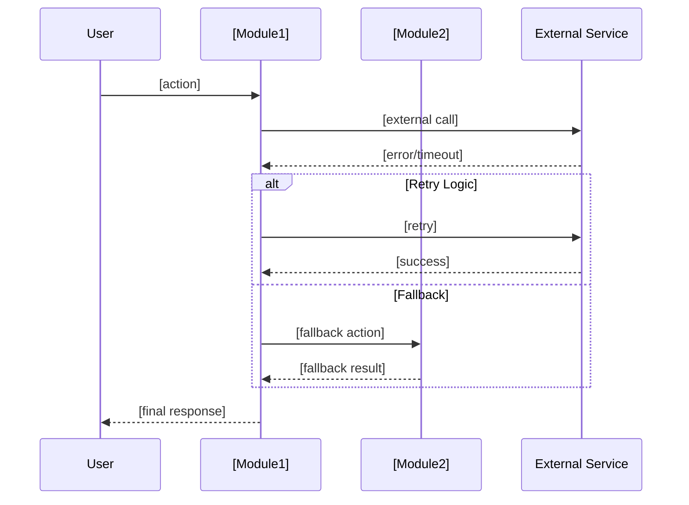
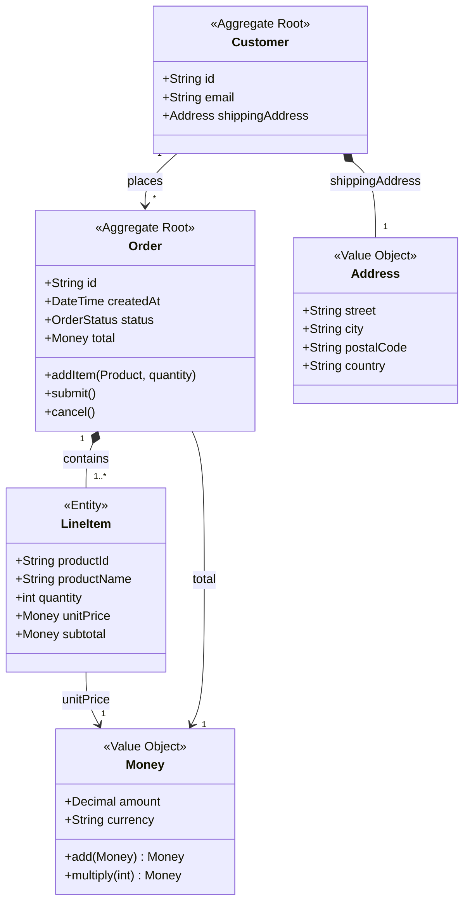

# Architect

Design system architecture using V-Model principles with BDD-style acceptance criteria.

## When to Use

Use this skill when starting a new feature or project that needs:
- Clear scope boundaries
- Testable acceptance criteria
- Implementation roadmap with traceability

## Output Files

This skill creates four files:

```
docs/arch/
├── ARCHITECTURE.md        # Vision, Boundaries, Ubiquitous Language, Design, Acceptance Criteria
├── DIAGRAMS.md            # Sequence diagrams (happy path + complex scenarios)
├── IMPLEMENTATION_PLAN.md # Tasks with traceability to acceptance criteria
└── INDEX.md               # Quick navigation for Ralph Loop
```

## Execution Flow

### Step 0: Understand the Project

Before asking questions, explore the current project to understand what we're building:

1. **Read existing documentation** (if present):
   - README.md, CLAUDE.md, docs/*.md
   - package.json, go.mod, Cargo.toml, pyproject.toml (for project name/description)
   - Any existing architecture docs

2. **Scan codebase structure** (if code exists):
   - Main directories and their purpose
   - Entry points (main.go, index.ts, app.py, etc.)
   - Existing modules/packages

3. **Identify project context**:
   - What is being built? (CLI tool, web app, library, service)
   - What problem does it solve?
   - What are the main features/capabilities?

4. **Detect communication language**:
   - Analyze README, CLAUDE.md, comments, commit messages to determine project's primary language
   - Use detected language for all communication with the user
   - If detected language is **not English**, ask about documentation language (see below)

5. **Assess information sufficiency**:

   If project purpose and features are **clear** → proceed to Step 1

   If project purpose is **unclear or missing**, use `AskUserQuestion`:
   ```
   Q - "Project Description": I couldn't find enough information about this project. Please describe:
     - What are you building?
     - What problem does it solve?
     - What are the main features you want?
   (free text input)
   ```

   If detected language is **not English**, use `AskUserQuestion`:
   ```
   Q - "Docs Language": Which language should the architecture documentation be in?
     Options:
     - English (international standard)
     - [Detected language] (match project language)
   ```

   **Terminology rule**: Regardless of chosen documentation language, established industry terms MUST remain in English: Ubiquitous Language, Bounded Context, Aggregate Root, Entity, Value Object, Repository, Acceptance Criteria, Given/When/Then, Happy Path, etc.

### Step 1: Gather Context

Before generating architecture, use `AskUserQuestion` to clarify:

```
Questions to ask (use AskUserQuestion tool):

Q1 - "Stack": Which technology stack?
  Options:
  - Go
  - Rust
  - Python
  - Node.js / TypeScript
  - .NET / C#
  - Other (specify)

Q2 - "Research": Should I research current best practices?
  Options:
  - Yes, research first (recommended for unfamiliar domains)
  - Skip research (use existing knowledge)

Q3 - "Search Tool" (only if Q2 = Yes): Which search tool to use?
  Options:
  - WebSearch (built-in)
  - perplexity-mcp
  - tavily-mcp
  - brave-search-mcp
  - Other MCP (specify)

Q4 - "Constraints": Any specific constraints?
  Description: "Performance requirements, integrations, compliance, existing systems..."
  (free text input)
```

### Step 2: Research (if requested)

If user requested research, use the selected search tool to gather current information.

#### 2.1 Framework Discovery

Search for modern frameworks for the selected stack:

```
Query examples:
- "best [Go/Rust/Python/etc] frameworks"
- "[stack] web framework comparison"
- "modern [stack] project structure"
- "[stack] recommended libraries production"
```

For each relevant framework found:
- Name and current stable version
- Key strengths (performance, DX, ecosystem)
- When to use vs alternatives
- Community health (active development, ecosystem)

#### 2.2 Best Practices Discovery

Search for implementation best practices:

```
Query examples:
- "[stack] best practices"
- "[stack] clean architecture"
- "[stack] error handling patterns"
- "[stack] testing strategies"
- "[domain] architecture patterns" (e.g., "event-driven architecture")
```

Look for:
- Project structure conventions
- Error handling approaches
- Logging and observability
- Configuration management
- Security best practices
- Testing strategies (unit, integration, e2e)

#### 2.3 Domain-Specific Research (if applicable)

If project has specific domain (fintech, healthcare, IoT, etc.):

```
Query examples:
- "[domain] [stack] implementation"
- "[domain] compliance requirements"
- "[domain] architecture examples"
```

#### 2.4 Synthesize Findings

Add **Research Summary** section to ARCHITECTURE.md (after Vision, before Boundaries):

```markdown
## Research Summary

### Recommended Stack
| Component | Choice | Rationale |
|-----------|--------|-----------|
| Framework | [Name] v[X.Y] | [Why this over alternatives] |
| Database | [Name] | [Why suitable for this project] |
| Testing | [Framework] | [Why chosen] |

### Key Best Practices
- **Project Structure**: [Convention, e.g., "hexagonal architecture"]
- **Error Handling**: [Pattern, e.g., "Result types over exceptions"]
- **Configuration**: [Approach, e.g., "12-factor app config"]
- **Testing**: [Strategy, e.g., "integration tests with testcontainers"]

### Sources
- [URL 1] - [What was useful]
- [URL 2] - [What was useful]
```

Focus on actionable recommendations. Include Sources for key findings but don't require citations for every claim.

### Step 3: Generate Architecture Document

Create `docs/arch/ARCHITECTURE.md` with this structure:

```markdown
# [Project Name] Architecture

## Vision

[2-3 sentences: What we're building, why it matters, what success looks like]

## Boundaries

### Building
- [Feature/capability 1]
- [Feature/capability 2]
- [Integration 1]

### Not Building
- [Explicitly excluded feature 1]
- [Explicitly excluded scope 2]

### Constraints
- [Technical constraint 1]
- [Performance requirement]
- [Compliance/security requirement]
- [Integration constraint]

## Ubiquitous Language

Define core domain terms. This vocabulary must be used consistently across all documents, code, and communication.

| Term | Definition | Example |
|------|------------|---------|
| **[Entity1]** | [Clear definition of this domain concept] | [Concrete example] |
| **[Entity2]** | [Clear definition] | [Example] |
| **[Action/Event]** | [What this means in our domain] | [Example] |
| **[State]** | [Definition of this state/status] | [When it occurs] |

### Relationships

- [Entity1] contains one or more [Entity2]
- [Entity2] can transition to [State] when [condition]
- [Action] is performed by [Actor] on [Entity1]

## System Design

### Components

| Module | Purpose |
|--------|---------|
| **[ModuleName1]** | [Single responsibility - what it does] |
| **[ModuleName2]** | [Single responsibility - what it does] |
| **[ModuleName3]** | [Single responsibility - what it does] |

### Data Flow



## Acceptance Criteria

Use BDD-style format. Group by feature area. Use terms from Ubiquitous Language.

### [FEATURE-CODE]: [Feature Name]

**[FEATURE-CODE]-AC1**: [Criterion title]
```
GIVEN [initial context using domain terms]
WHEN [action performed]
THEN [expected outcome]
```

**[FEATURE-CODE]-AC2**: [Another criterion]
```
GIVEN [context]
WHEN [actor performs action]
THEN [observable outcome - passive voice]
AND [additional observable outcome]
```

### [FEATURE-CODE-2]: [Another Feature]

**[FEATURE-CODE-2]-AC1**: ...


### Step 4: Generate DIAGRAMS.md

**IMPORTANT**: All diagrams MUST use Mermaid format. Never use ASCII art, PlantUML, or other diagram formats.

Create `docs/arch/DIAGRAMS.md` with sequence diagrams:

```markdown
# [Project Name] Diagrams

Sequence diagrams for key scenarios. Refer to [Ubiquitous Language](./ARCHITECTURE.md#ubiquitous-language) for term definitions.

## Happy Path Scenarios

### [FEATURE-CODE]-HP1: [Scenario Name]

[Brief description of this typical successful flow]



### [FEATURE-CODE]-HP2: [Another Happy Path]

```mermaid
sequenceDiagram
    ...
```

## Complex Scenarios

### [FEATURE-CODE]-CS1: [Complex Scenario Name]

[Description: error handling, retry logic, concurrent access, etc.]



### [FEATURE-CODE]-CS2: [Another Complex Scenario]

[Description: race condition handling, transaction rollback, etc.]

```mermaid
sequenceDiagram
    ...
```

## Class Diagrams (if applicable)

Include class diagrams when the domain has:
- Multiple related entities with distinct properties
- Complex relationships (ownership, containment, associations)
- Aggregate boundaries that need visualization

### Domain Model

Use Ubiquitous Language terms from [ARCHITECTURE.md](./ARCHITECTURE.md#ubiquitous-language).



### Class Diagram Guidelines

**When to include**:
- Domain has 3+ entities with relationships
- Aggregate boundaries need clarification
- Value objects vs entities distinction matters

**Annotations** (from DDD):
- `<<Aggregate Root>>` - Entry point to aggregate, owns consistency boundary
- `<<Entity>>` - Has identity, lifecycle within aggregate
- `<<Value Object>>` - Immutable, defined by attributes, no identity
- `<<Repository>>` - Persistence abstraction for aggregates
- `<<Service>>` - Stateless domain operations

**Relationship types**:
- `*--` Composition: Child cannot exist without parent (Order *-- LineItem)
- `o--` Aggregation: Child can exist independently (Department o-- Employee)
- `-->` Association: Knows about, references (Customer --> Order)

**Multiplicity notation**:
- `"1"` - Exactly one
- `"0..1"` - Zero or one (optional)
- `"*"` or `"0..*"` - Zero or more
- `"1..*"` - One or more (at least one)
```

### Step 5: Generate IMPLEMENTATION_PLAN.md

Create `docs/arch/IMPLEMENTATION_PLAN.md`:

```markdown
# [Project Name] Implementation Plan

**Role**: Persistent memory for Ralph Loop. Progress tracked here survives across sessions.

Tasks with traceability to [Acceptance Criteria](./ARCHITECTURE.md#acceptance-criteria).

## Overview

| Phase | Tasks | Criteria Covered |
|-------|-------|------------------|
| 1. Foundation | 2 | Setup |
| 2. Core | 3 | [FEATURE-CODE]-AC1..AC4 |
| 3. Integration | 2 | [FEATURE-CODE-2]-AC1..AC2 |
| **Total** | **7** | **All criteria** |

## Phase 1: Foundation

- [ ] **Task 1.1**: [Setup description]
  - [ ] Subtask: Initialize project structure
  - [ ] Subtask: Configure build tools
  - [ ] Subtask: Setup test infrastructure
  - Covers: Infrastructure (no AC)

- [ ] **Task 1.2**: [Another setup task]
  - [ ] Subtask details
  - Covers: Infrastructure

## Phase 2: Core Features

- [ ] **Task 2.1**: [Feature implementation]
  - [ ] Subtask: Implement [Module1] interface
  - [ ] Subtask: Add validation logic
  - [ ] Subtask: Write integration tests
  - Covers: [FEATURE-CODE]-AC1, [FEATURE-CODE]-AC2

- [ ] **Task 2.2**: [Another feature]
  - [ ] Subtask details
  - Covers: [FEATURE-CODE]-AC3

- [ ] **Task 2.3**: [Feature completion]
  - [ ] Subtask details
  - Covers: [FEATURE-CODE]-AC4

## Phase 3: Integration

- [ ] **Task 3.1**: [Integration task]
  - [ ] Subtask: Connect modules
  - [ ] Subtask: End-to-end testing
  - Covers: [FEATURE-CODE-2]-AC1

- [ ] **Task 3.2**: [Final integration]
  - [ ] Subtask details
  - Covers: [FEATURE-CODE-2]-AC2

## Traceability Matrix

| Acceptance Criterion | Task(s) | Status |
|---------------------|---------|--------|
| [FEATURE-CODE]-AC1 | Task 2.1 | |
| [FEATURE-CODE]-AC2 | Task 2.1 | |
| [FEATURE-CODE]-AC3 | Task 2.2 | |
| [FEATURE-CODE]-AC4 | Task 2.3 | |
| [FEATURE-CODE-2]-AC1 | Task 3.1 | |
| [FEATURE-CODE-2]-AC2 | Task 3.2 | |

**Status values**: ` ` → `In Progress` → `Implemented` → `Tested`

**Coverage**: All acceptance criteria have implementing tasks.
```

### Step 6: Generate INDEX.md

Create `docs/arch/INDEX.md` for quick navigation:

```markdown
# Architecture Index

Quick reference for navigating architecture documents.

## Files

| File | Purpose | When to Read |
|------|---------|--------------|
| [ARCHITECTURE.md](./ARCHITECTURE.md) | Design & acceptance criteria | Current task's criteria |
| [DIAGRAMS.md](./DIAGRAMS.md) | Sequence diagrams | Understanding complex flows |
| [IMPLEMENTATION_PLAN.md](./IMPLEMENTATION_PLAN.md) | Task checklist | Finding next task, marking done |

## Domain Terms

Quick reference from [Ubiquitous Language](./ARCHITECTURE.md#ubiquitous-language):

| Term | Definition |
|------|------------|
| **[Term1]** | [One-line definition] |
| **[Term2]** | [One-line definition] |

## Modules

| Module | Purpose |
|--------|---------|
| [Module1] | [Brief] |
| [Module2] | [Brief] |

## Tasks → Criteria Mapping

| Task | Covers | Related Diagrams |
|------|--------|------------------|
| Task 1.1 | Infrastructure | - |
| Task 2.1 | [CODE]-AC1, AC2 | [CODE]-HP1 |
| Task 2.2 | [CODE]-AC3 | [CODE]-CS1 |

## Progress

- **Total Tasks**: [T]
- **Completed**: 0
- **Acceptance Criteria**: [P]
- **Covered**: [P] (100%)
```

### Step 7: Confirm Output

After generating all four files, tell user:

```
Created:
- docs/arch/ARCHITECTURE.md
- docs/arch/DIAGRAMS.md
- docs/arch/IMPLEMENTATION_PLAN.md
- docs/arch/INDEX.md

Summary:
- [N] domain terms in Ubiquitous Language
- [M] modules defined
- [K] sequence diagrams (happy path + complex) + class diagrams (if applicable)
- [P] acceptance criteria
- [T] implementation tasks
- Traceability: 100% criteria covered

Next step: Run /implement to generate Ralph Loop setup
```

## Guidelines

### BDD Rules for Acceptance Criteria

**Strict Rules** (numbered for LLM compliance):

1. **No Implementation Leaks**: Never mention internal service/module names in Gherkin (WorldService, StateRepository, Kafka). Use domain roles (System, Platform) or passive voice.

2. **Passive THEN Clauses**: THEN must describe observable state/outcome, not action.
   - BAD: "THEN the Service saves the data" (active/procedural)
   - GOOD: "THEN the data is persisted" (passive/state)
   - GOOD: "THEN the user receives confirmation" (observable)

3. **Atomic WHEN**: Single trigger action per scenario.

4. **Ubiquitous Language Only**: Use domain terms, not technical terms.

**Two-Layer Architecture**:
- **Gherkin** = Contract for Business (WHAT we do)
- **Interfaces** = Contract for Developers (HOW we do it)
- Connected via glue code (test step implementations), not via text

### Acceptance Criteria Quality

Good criteria are:
- **Testable**: Can write a test that passes/fails
- **Outcome-focused**: Describes observable results, not internal actions
- **Independent**: Each criterion stands alone
- **Valuable**: Ties to user-visible behavior

**BAD** (vague):
```
System should be fast
```

**BAD** (implementation leak):
```
GIVEN a search query
WHEN user submits search
THEN SearchModule calls CacheService
AND CacheService returns results
AND SearchModule formats response within 200ms
```

**GOOD** (outcome-focused):
```
GIVEN a catalog with 10,000 products
WHEN user searches for "laptop"
THEN search results appear within 200ms
AND results contain matching products
```

### Module Granularity

- Each module = one clear responsibility
- If description has "and", consider splitting
- 3-7 modules is typical for medium projects

### Task Traceability

Every task should trace to at least one acceptance criterion.
Every acceptance criterion should be covered by at least one task.

No orphan tasks. No uncovered criteria.
