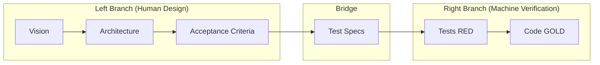

# Architect

Design system architecture using V-Model principles with BDD-style acceptance criteria.

## V-Model Overview



This skill implements the **Left Branch** — from Vision to Test Specs.
The `/implement` skill bridges to the **Right Branch** via GS-TDD.

## When to Use

Use this skill when starting a new feature or project that needs:
- Clear scope boundaries
- Testable acceptance criteria
- Implementation roadmap with traceability

## Output Files

This skill creates four files in `docs/arch/`:

| File | Purpose |
|------|---------|
| ARCHITECTURE.md | Vision, Boundaries, Ubiquitous Language, Design, Acceptance Criteria |
| DIAGRAMS.md | Sequence diagrams (happy path + complex scenarios) + Class diagrams |
| IMPLEMENTATION_PLAN.md | Tasks with traceability to acceptance criteria |
| INDEX.md | Quick navigation for Ralph Loop |
| TESTS.md | Test specification with code examples |
| PROJECT_STRUCTURE.md | Target directory layout and conventions |
| INFRASTRUCTURE.md | Docker compose + test infrastructure (if external services needed) |

## Templates

Templates are located at `{CLAUDE_PLUGIN_ROOT}/skills/design/templates/`:
- `ARCHITECTURE.md.template`
- `DIAGRAMS.md.template`
- `IMPLEMENTATION_PLAN.md.template`
- `INDEX.md.template`
- `TESTS.md.template`
- `PROJECT_STRUCTURE.md.template`
- `INFRASTRUCTURE.md.template`

Read templates before generating files.

## Current Context

`$CURRENT_YEAR`: !`date +%Y`

Use `$CURRENT_YEAR` value in ALL search queries. NEVER hardcode years like "2024" or "2025".

## Execution Flow

### Step 0: Explore Project

**Read-only exploration.** Understand the project before asking questions.

1. **Read existing documentation** (if present):
   - README.md, CLAUDE.md, docs/*.md
   - package.json, go.mod, Cargo.toml, pyproject.toml
   - Any existing architecture docs

2. **Scan codebase structure** (if code exists):
   - Main directories and their purpose
   - Entry points (main.go, index.ts, app.py, etc.)
   - Existing modules/packages

3. **Check `docs/arch/` directory**:
   - If architecture files already exist, note this for Step 1
   - Do NOT overwrite without asking

4. **Detect communication language**:
   - Analyze README, CLAUDE.md, comments to determine project's primary language
   - Use detected language for all user communication

5. **Assess information sufficiency**:
   - Is project purpose clear?
   - Are main features identifiable?
   - Note gaps for Step 1

### Step 1: Gather Requirements

Use `AskUserQuestion` to gather all needed information. Questions are organized in blocks with checkpoints.

## Stack-Framework Compatibility

Fallback reference when research yields no results:

| Stack | Valid Test Frameworks | Default |
|-------|----------------------|---------|
| Go | go test, testify | go test + testify |
| Rust | cargo test | cargo test |
| Python | pytest, unittest | pytest |
| TypeScript/Node | Jest, Vitest, Mocha | Vitest |
| Java | JUnit 5, TestNG | JUnit 5 |
| Kotlin | JUnit 5, Kotest | Kotest |
| .NET | xUnit, NUnit | xUnit |

**IMPORTANT**: This table does NOT include framework versions.
Always research current LTS/stable versions during Step 2.1.
Version selection is critical — never assume versions from this table.

**Note**: Used as fallback if research yields no results. Test framework selection happens in Step 2.

---

**Block A: Core Decisions** (Q1-Q3)

```
Q1 - "Stack": Which technology stack?
  Options:
  - Go
  - Rust
  - Python
  - Node.js / TypeScript
  - .NET

Q2 - "Docs Language": Which language for architecture documentation?
  Options (order by detected project language):
  - [Detected language] (Recommended - match project)
  - English
  - Russian
  - Other (specify)
  Note: If no language detected, show alphabetically without "Recommended"

Q3 - "Research": Should I research current best practices?
  Options:
  - Yes, research first (recommended for unfamiliar domains)
  - Skip research (use existing knowledge)

**Checkpoint A**: After Q1-Q3, display summary and ask:

```
Current choices:
- Stack: {Q1 answer}
- Docs Language: {Q2 answer}
- Research: {Q3 answer}

Review your choices. Want to change anything?
Options:
- Continue (Recommended)
- Change Stack
- Change Docs Language
- Change Research
```

If user selects a change option, re-ask that specific question then return to checkpoint.

---

**Block B: Test Configuration** (Q4-Q6)

Q4 - "Test Types": Which test types to implement?
  Options:
  - Integration tests only (Recommended for new projects - testcontainers)
  - Unit + Integration tests
  - Unit tests only
  - Unit + Integration + E2E tests
  (multiSelect: false)

Q5 - "Integration Tests": How should integration tests run?
  Options:
  - Testcontainers (Recommended - per-test isolation, CI-friendly)
  - Docker Compose scripts (for complex multi-service setups)
  Note: Only shown if Q4 includes integration tests

Q6 - "External Services": Does this project need external services for testing?
  Options:
  - Yes, database (PostgreSQL, MySQL, etc.)
  - Yes, cache (Redis, Memcached)
  - Yes, message queue (RabbitMQ, Kafka)
  - Yes, multiple services (will ask details)
  - No external services needed
  (multiSelect: true)

**Checkpoint B**: After Q4-Q6, display summary and ask:

```
Test configuration:
- Test Types: {Q4 answer}
- Integration Approach: {Q5 answer or "N/A"}
- External Services: {Q6 answer}

Review your choices. Want to change anything?
Options:
- Continue (Recommended)
- Change Test Types
- Change Integration Approach
- Change External Services
```

If user selects a change option, re-ask that specific question then return to checkpoint.

---

**Second question block** (conditional):

If Q3 = "Yes, research first", ask separately:
```
Q7 - "Search Tool": Which search tool to use?
  Options: [List available search tools from MCP servers or built-in WebSearch]
```

**Third question block** (always ask):

```
Q8 - "Constraints": Any specific constraints?
  Description: "Performance requirements, integrations, compliance, existing systems..."
  (free text input)
```

**Conditional questions** based on Step 0 findings:

If project purpose is **unclear**:
```
Q - "Project Description": Please describe:
  - What are you building?
  - What problem does it solve?
  - What are the main features?
(free text input)
```

If `docs/arch/` files **already exist**:
```
Q - "Existing Files": Architecture files already exist in docs/arch/. How to proceed?
  Options:
  - Overwrite all (start fresh)
  - Review and update (preserve what's good)
  - Cancel (keep existing)
```

**Terminology rule**: Regardless of documentation language, industry terms remain in English: Ubiquitous Language, Bounded Context, Aggregate Root, Entity, Value Object, Acceptance Criteria, Given/When/Then, etc.

### Step 2: Research (if requested)

If user requested research, use available search tools to gather information.

**Research Fallback Strategy**: If search returns no useful results:
1. Try alternative search tool (e.g., context7-mcp for documentation)
2. If still empty: use stack defaults from Stack-Framework Compatibility matrix
3. Notify user: "Using default conventions for {stack}. You can customize in Step 5."

#### 2.1 Framework Discovery

Search for modern frameworks for the selected stack:
- "{stack} latest stable version $CURRENT_YEAR"
- "{stack} LTS version $CURRENT_YEAR" (for stacks with LTS: .NET, Node.js)
- Best frameworks and libraries for {stack}
- Project structure conventions

**Version Selection Priority**:
1. For production projects: Latest LTS/Stable version
2. For experimental projects: Latest version (ask user if unclear)

**Stack-specific version queries**:
| Stack | Search Query |
|-------|--------------|
| .NET | "dotnet latest LTS version $CURRENT_YEAR" |
| Node.js | "nodejs LTS version $CURRENT_YEAR" |
| Go | "go latest stable version $CURRENT_YEAR" |
| Python | "python latest stable version $CURRENT_YEAR" |
| Rust | "rust latest stable version $CURRENT_YEAR" |

**Fallback**: Use defaults from Stack-Framework Compatibility table.

#### 2.2 Test Framework Discovery

Search for current test frameworks for the selected stack:
- "{stack} test framework best practices $CURRENT_YEAR"
- "{stack} testing library comparison $CURRENT_YEAR"

**Then ask user with AskUserQuestion:**

```
Q - "Test Framework": Which test framework to use?
  Options (from research results, max 4):
  - [Found framework 1] (Recommended if most popular)
  - [Found framework 2]
  - [Found framework 3]
  - Other (specify)
```

**Fallback**: If research yields no results, use Stack-Framework Compatibility table defaults.

**If user selected "Skip research" in Q3**: Show test framework options directly from Stack-Framework Compatibility table (no search needed).

#### 2.3 Best Practices Discovery

Search for implementation patterns:
- Error handling approaches
- Testing strategies
- Configuration management
- Security best practices

**Fallback**: Use standard patterns for the stack (documented in step 2.6).

#### 2.4 Domain-Specific Research (if applicable)

If project has specific domain (fintech, healthcare, IoT):
- Domain architecture patterns
- Compliance requirements
- Industry examples

#### 2.5 Infrastructure Research (if external services needed)

If user selected external services in Q6 (External Services), search for current Docker images:

```
Search queries:
- Database: "{database_type} docker image latest stable version $CURRENT_YEAR"
- Cache: "redis docker image latest stable $CURRENT_YEAR"
- Message queue: "rabbitmq docker image official $CURRENT_YEAR"
```

**Important**:
- Record exact image tags with versions (e.g., `postgres:16.4-alpine`)
- NEVER use `:latest` tag — pin specific versions for reproducibility
- Prefer `-alpine` variants when available (smaller images)
- Note health check commands for each service

Example search results to record:
```
| Service | Image | Health Check |
|---------|-------|--------------|
| PostgreSQL | postgres:16.4-alpine | pg_isready -U postgres |
| Redis | redis:7.4-alpine | redis-cli ping |
| RabbitMQ | rabbitmq:3.13-management-alpine | rabbitmq-diagnostics check_running |
```

#### Application Base Image Research

Search for current base Docker images for the selected stack:
- Go: "golang docker image latest stable version $CURRENT_YEAR"
- Python: "python docker image slim latest $CURRENT_YEAR"
- Node.js: "node docker image alpine LTS $CURRENT_YEAR"
- Rust: "rust docker official image $CURRENT_YEAR"
- .NET: "dotnet sdk aspnet docker image $CURRENT_YEAR"

Record:
- Build stage image (with SDK/compiler)
- Runtime stage image (minimal, for production)
- Prefer `-alpine` or `-slim` variants
- Pin specific versions (e.g., `golang:1.23-alpine`, NOT `golang:latest`)

#### 2.6 Project Structure Research

Search for:
- "[stack] project structure best practices $CURRENT_YEAR"
- "[framework] recommended folder layout"
- "[stack] clean architecture project structure"

If research yields results:
- Extract directory conventions
- Note file naming patterns
- Identify required config files

If no useful results found, use stack defaults:
- **Go**: `cmd/`, `internal/`, `pkg/`, `test/`
- **Python**: `src/{project}/`, `tests/`
- **Node.js/TypeScript**: `src/`, `lib/`, `tests/`, `dist/`
- **Rust**: `src/`, `tests/`, `benches/`
- **.NET**: `src/{Project}/`, `tests/{Project}.Tests/`

#### 2.7 Synthesize Findings

Add **Research Summary** section to ARCHITECTURE.md (after Vision, before Boundaries):

```markdown
## Research Summary

### Recommended Stack
| Component | Choice | Rationale |
|-----------|--------|-----------|
| Framework | [Name] v[X.Y] | [Why this over alternatives] |
| Database | [Name] | [Why suitable] |
| Testing | [Framework] | [Why chosen] |

### Key Best Practices
- **Project Structure**: [Convention]
- **Error Handling**: [Pattern]
- **Testing**: [Strategy]

### Sources
- [URL 1] - [What was useful]
- [URL 2] - [What was useful]
```

#### 2.8 Preview Output Structure

Before generating files, show user preview:

```
Files to be created in docs/arch/:

| File | Contents |
|------|----------|
| ARCHITECTURE.md | Vision, {N} modules, {M} acceptance criteria |
| DIAGRAMS.md | {X} sequence diagrams, {Y} class diagrams |
| IMPLEMENTATION_PLAN.md | {T} tasks across {P} phases |
| INDEX.md | Quick navigation index |
| TESTS.md | Test specs for {M} criteria |
| PROJECT_STRUCTURE.md | Directory layout for {stack} |
| INFRASTRUCTURE.md | Docker config for {services} | (if applicable)

Estimated acceptance criteria: {M}

Proceed with generation?
Options:
- Generate files (Recommended)
- Adjust scope first
```

If user selects "Adjust scope first", ask what to change and loop back.

### Step 3: Generate Architecture Files

Read templates from `{CLAUDE_PLUGIN_ROOT}/skills/design/templates/` then create files in `docs/arch/`:

1. **ARCHITECTURE.md** - Use `ARCHITECTURE.md.template`
2. **DIAGRAMS.md** - Use `DIAGRAMS.md.template`
3. **IMPLEMENTATION_PLAN.md** - Use `IMPLEMENTATION_PLAN.md.template`
4. **INDEX.md** - Use `INDEX.md.template`
5. **TESTS.md** - Use `TESTS.md.template` (always generate)
6. **PROJECT_STRUCTURE.md** - Use `PROJECT_STRUCTURE.md.template`:
   - Map each module from ARCHITECTURE.md to directory path
   - Apply research findings OR stack defaults from Step 2.5
   - Include all config files from INFRASTRUCTURE.md
   - Ensure test layout matches TESTS.md
7. **INFRASTRUCTURE.md** - Use `INFRASTRUCTURE.md.template` (only if external services selected in Q6)

**IMPORTANT**: All diagrams MUST use Mermaid format. Never use ASCII art or PlantUML.

**TESTS.md requirements**:
- Include test code examples for EACH acceptance criterion
- Map chosen test framework from Q4
- Include actual commands based on selected stack
- Coverage matrix must list ALL acceptance criteria

**INFRASTRUCTURE.md requirements** (if generated):
- Use pinned image versions from Step 2.4 research (NEVER `:latest`)
- Include health check commands for each service
- Provide both Docker Compose config and Testcontainers code example
- Include connection string templates

### Step 4: Validate

Before presenting to user, verify quality:

**Consistency checks:**
- [ ] All Ubiquitous Language terms are used in Acceptance Criteria
- [ ] All Acceptance Criteria have at least one implementing task
- [ ] All tasks reference at least one Acceptance Criterion (except infrastructure)
- [ ] Diagram participants match defined modules
- [ ] FEATURE-CODEs are consistent across all files

**Quality checks:**
- [ ] No implementation details in GIVEN/WHEN/THEN (no module names)
- [ ] THEN clauses use passive voice (observable outcomes)
- [ ] Each module has single responsibility

**Test specification checks (TESTS.md):**
- [ ] Every AC has corresponding test specification with code example
- [ ] Test stack matches selected technology stack from Q1/Q4
- [ ] All commands are valid for the selected framework
- [ ] Coverage matrix lists ALL acceptance criteria

**Infrastructure checks (INFRASTRUCTURE.md, if generated):**
- [ ] All Docker images have pinned versions (no `:latest`)
- [ ] Health checks defined for every service
- [ ] Connection strings documented
- [ ] Startup/shutdown commands complete and correct

**Placeholder check:**
- [ ] Scan all generated files for unreplaced placeholders matching `{[a-z_]+}`
- [ ] If found: list all unreplaced placeholders, ask user to provide values, replace and re-validate

If issues found, fix them before proceeding.

See [validation-rules.md](./validation-rules.md) for detailed BDD and traceability rules.

### Step 5: Review

Present results to user with `AskUserQuestion`:

```
Architecture documentation created in docs/arch/:

Files:
- ARCHITECTURE.md ([N] lines)
- DIAGRAMS.md ([M] lines)
- IMPLEMENTATION_PLAN.md ([K] lines)
- INDEX.md ([L] lines)
- TESTS.md ([T] lines)
- PROJECT_STRUCTURE.md ([P] lines)
- INFRASTRUCTURE.md ([I] lines) — if external services needed

Metrics:
- Domain terms: [X]
- Modules: [Y]
- Acceptance criteria: [Z]
- Implementation tasks: [T]
- Diagrams: [D] sequence + [C] class
- Test specifications: [S]
- External services: [E] (or "none")

Traceability: 100% criteria covered
Test coverage: 100% criteria have test specifications

Q - "Review": How would you like to proceed?
  Options:
  - Proceed to /implement (Recommended)
  - I have feedback (describe changes needed)
  - Start over (regenerate from scratch)
```

If user selects **"I have feedback"**:
- Ask for specific feedback
- Regenerate only affected files
- Return to Step 5

### Step 6: Finalize

After user approves, confirm:

```
Architecture design complete.

Next step: Run /implement to start Ralph Loop
```

## Guidelines

> **Note**: Detailed validation rules are in [validation-rules.md](./validation-rules.md).

### BDD Rules for Acceptance Criteria

**Strict Rules** (see validation-rules.md for full details):

1. **No Implementation Leaks**: Never mention internal service/module names in Gherkin. Use domain roles or passive voice.

2. **Passive THEN Clauses**: THEN must describe observable state/outcome, not action.
   - BAD: "THEN the Service saves the data"
   - GOOD: "THEN the data is persisted"

3. **Atomic WHEN**: Single trigger action per scenario.

4. **Ubiquitous Language Only**: Use domain terms, not technical terms.

### Class Diagram Guidelines

**When to include**:
- Domain has 3+ entities with relationships
- Aggregate boundaries need clarification
- Value objects vs entities distinction matters

**DDD Annotations**:
- `<<Aggregate Root>>` - Entry point to aggregate
- `<<Entity>>` - Has identity, lifecycle within aggregate
- `<<Value Object>>` - Immutable, no identity
- `<<Repository>>` - Persistence abstraction
- `<<Service>>` - Stateless domain operations

**Relationships**:
- `*--` Composition: Child cannot exist without parent
- `o--` Aggregation: Child can exist independently
- `-->` Association: References

**Multiplicity**: `"1"`, `"0..1"`, `"*"`, `"1..*"`

### Module Granularity

- Each module = one clear responsibility
- If description has "and", consider splitting
- 3-7 modules is typical for medium projects

### Task Traceability

Every task should trace to at least one acceptance criterion.
Every acceptance criterion should be covered by at least one task.
No orphan tasks. No uncovered criteria.
